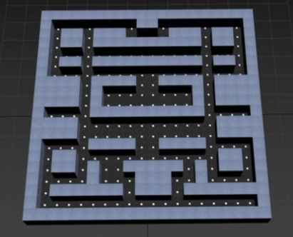

# Comecocos_MaxScript
Plugin para 3DSMax realizado en MaxScript que permite:
- Generación de un mapa para Pacman con cocos ajustando los siguientes parámetros
  - Posición X,Y,Z del mapa
  - Tamaño
  - Suelo (por defecto, cambiando el color o añadiendo un material)
  - Pared (por defecto, cambiando el color o añadiendo un material), además de cambiar la altura
  - Se puede personalizar el mapa o elegir uno aleatorio 
- Simular que pacman puede comerse a los comecocos cambiando de color (a azul) a los fantasmas durante un intervalo de fotogramas dado
- Deformar a los fantasmas al morir con modificadores Twist y Blend

Este plugin se ha utilizado para el siguiente tráiler: https://www.youtube.com/watch?v=P--LD5HjmEI&t=1s&ab_channel=GasparMr6

Ejemplo de mapa generado con el Plugin:

